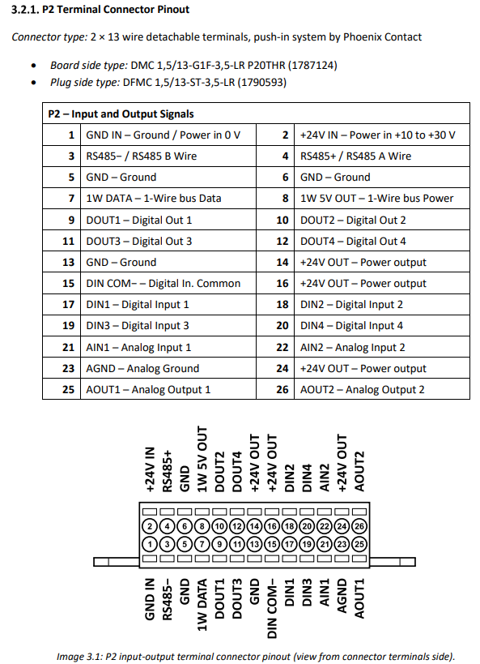
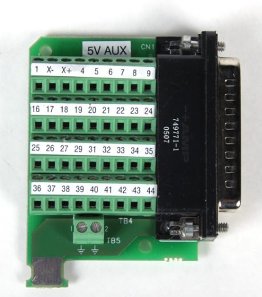
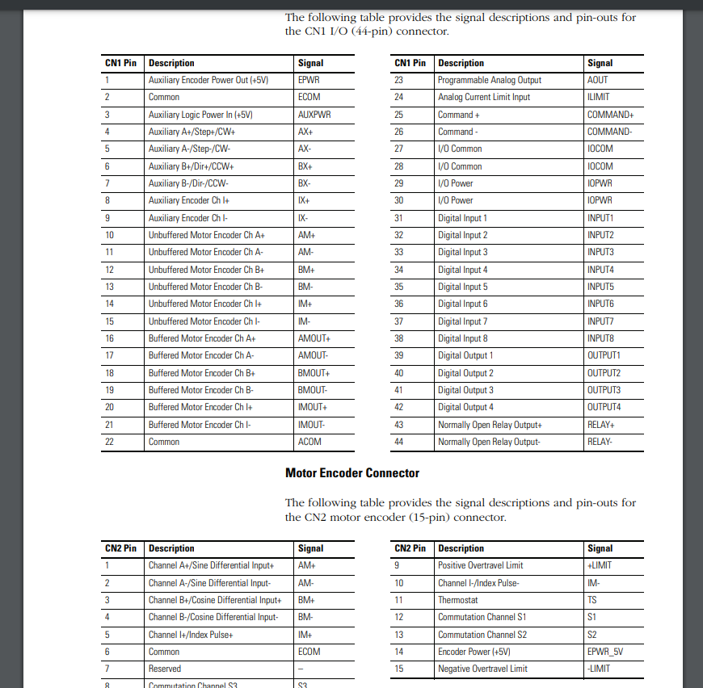
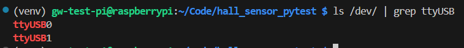

# Hardware Configuration

## Monarco Rasberry PI HAT

This test setup utilizes an Monarco Raspberry PI hat for PLC.


The diagram for the pinout for the head is shown below.



The following table details the connections for the motor test setup.

### Monarco PLC Pinout Header
|Monarco Header Pin| Pin Description | Outside World Connection |
|--------| -------------| --------------------------|
|1|24V- (GND)|Power Supply Ground (24V -)|
|2|24V+ | Power Supply 24V+|
|5|GND|PIN 27 CN1 2090-U3BB2-DM44 Breakout Connector|
|6|GND|Future Connection of Procuity Analog Sensor|
|9|DOUT1|Open-Drain, Connected to CN1-PIN 31 and 24V via 10k pull-up resistor|
|10|DOUT2|Open-Drain, Connected to CN1-PIN 32 and 24V via 10k pull-up resistor|
|11|DOUT3|Open-Drain, Connected to CN1-PIN 33 and 24V via 10k pull-up resistor|
|13|GND|AGND Header PIN 23|
|14|+24V OUT|Pin 29 CN1 - Digital IO Power|
|16|+24V Out|24V pull-up through 10K resisors for open-drain DOUTs|
|17|DIN1|Pin 39 CN1 - Servo Digital Output 1|
|18|DIN2|Pin 40 CN1 - Servo Digital Output 2|
|19|DIN3|Pin 41 CN1 - Servo Digital Output 3|
|21|AIN1|Future Procuity Analog Output|
|23|AGND|GND Header PIN 13|


## Rockwell Servo Drive Connection

All connections made to the rockwell service drive gpio are connected to the CN1 connection.
This pin terminal adapter is shown below.



The pin description is shown in the picture below.




## Serial Control and Configuration

Connect a usb-232 serial adapter to the USB port on the Raspberry Pi. Hook the termination end into the serial cable adapater from the Ultraware PLC device.

This serial cable is used to read the reported encoder position and write to the index 0 position command to drive to various encoder positions.

Note the reads/writes in serial to the servo utilize line endings of only the `\r` character.

## Hall Sensor

The 3-dimensional hall sensor board takes between 7-12V.

The hall sensor outputs serial information via the prototype wires attached to microcontroller sensors body.

This information can be read using any FTDI TTL 3.3V logic serial cable. [An example cable is available here.](https://ftdichip.com/wp-content/uploads/2023/07/DS_TTL-232R_CABLES.pdf)

Connect the pinout as follows:

|Wire Color| Destination|
|---|----------------------|
|Red Wire| 12V+ Power Supply|
|Black Wire| GND Power Supply|
|Yellow Wire| NC or Connect to Monarco PLC HAT AN1|
|||
|Green TX Serial Wire| Yellow RX FTDI Wire|
|White RX Serial Wire| Orange TX FTDI Wire|
|Black Serial Wire| Black FTDI Wire|

Connect the Serial FTDI Wire to the Raspberry Pi's USB Port

### Getting Serial Port Path

Get the path to the USB serial device on Raspberry PI with the following command.

```console
ls /dev/ | grep ttyUSB
```

This should output results similar to the following



For port in the `config.ini` file specify the full path to this device. As demonstrated in the example below.

### Pytest Config.ini example

```config.ini
[Serial]
;X below == your serial port value
hall_sensor.Port = /dev/ttyUSBX
```

# Software Configuration

## Creating an SSH connection with the raspberry pi.

To create an ssh connection with the raspberry pi. We will first sign into the device using the username and password.

On the device you are connecting from navigate to your ssh folder and run the following command. Note the ssh folder is typically in your `C:/Users/<user>/.ssh`

```console
ssh-keygen -t ed25519 -f testlab-pi -C <user>@user_pc_name
```

press enter twice to complete generation of a key.

Next use the following command and copy the output of the command.

```console
cat testlab-pi.pub
```

Log into the raspberry pi and cd into its .ssh directory using the following command.

```console
ssh <your_rasp_pi_user_name>@<raspberry-pi-ip-address>
```

Enter password

Then use the following to make a directory if it does not exist.

```console
mkdir .ssh
```

Then change directory into that directory with the following:

```console
cd .ssh
```

The run the following.

```console
echo <ctrl-shift-v> | >> authorized_keys
```

Sign out of the raspberry pi. Next we will create a config entry in our `C:/Users/<user>/.ssh/config path on our connecting PC, your windows PC

```console
code config
```

Edit the text below with the updated ip address of our given device. 

```text
Host testlab-pi
    HostName <raspberry-pi-IP-address-goes-here>
    User gw-test-pi
    IdentityFile ~/.ssh/testlab-pi
```

Note the identity file path is the path to the private key we created in the steps at the beginning of this section.

Now typing the following command should allow one to connect to the raspberry pi without typing their password.

```console
ssh testlab-pi
```

## Creating virtual environment

After connecting and navigating to this repository where this repo was cloned, run the following command to create a python virutal environment.

```console
python3.11 -m venv venv
```
Next activate the environement with the following command.
Activating virtual environment

```console
. venv/bin/activate
```

## Installing required python packages

Run the following command to install the required python packages for testing

```console
pip install -r requirements.txt
```

# Running Tests

To run the pytest tests, simply type `pytest` and hit enter from the root directory containing the test_hall_sensor.py file.

pytest will sesarch for all files named test_XXX.py and then subsequenlty all test case functions named test_XXX. where X is just the name of the file or the function. I.E. test_motor_move().

## Collecting artifacts

To collect the artifacts of the pytest run. A directory called Artifacts is created. Each test session gets its own Timestamped directory. And inside this directory is a directory for each test case which was run.

Copy this directory to a location in the /home/ with the following script.

```console
./copy.sh
```

This script should grab the latest test run in paste it into a directory with the following path.

`~/ArtifactsToSend/latest/

## Copying the files to your windows machine for post processing / analysis

To transfer / copy the files over to your windows machine, or any other machine. Use the following command **from your windows machine**

```console
scp -r testlab-pi:~/ArtifactsToSend/latest/ <your_desired_file_path>
```

# Specialty Servo Commands

